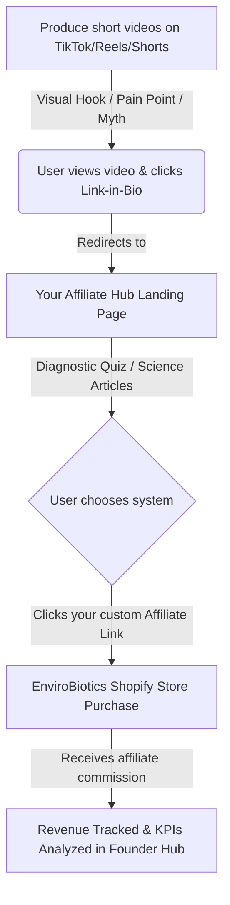

# 7-DAY ONBOARDING MANUAL — ENVIROBIOTICS AFFILIATE HUB
*For Affiliate Founders and Content Creators promoting Probiotic Air & Surface Care globally*

Welcome to the **EnviroBiotics Affiliate Hub**! This document is your step-by-step launch roadmap (used in tandem with the built-in interactive **Founder Hub** checklist) designed to help you set up, film, publish, and optimize your affiliate marketing system for EnviroBiotics products within 7 days.

---

## BUSINESS MODEL OVERVIEW

### 1. Core Philosophy: "Clean doesn't mean sterile"
Traditional cleaning relies on harsh chemicals (disinfectant sprays, bleach, chemical wipes) that wipe out 99.9% of bacteria. This eliminates the beneficial bacteria along with the bad, creating a microbial vacuum that allows resilient pathogens, mold, and dust mites to recolonize surfaces rapidly. 

We position ourselves as a **Living Lab** and education center. We teach the science of **competitive exclusion**: introducing billions of beneficial, EPA-Registered probiotic strains into the indoor environment to build a self-sustaining microbial shield that outcompetes allergens, mold, and pathogens naturally.

### 2. High-Value Device + Recurring Subscription Model:
*   **Hardware Tier (High AOV):** BioLogic Mini ($99), Biotica 800 ($249), and E Biotic Home ($599+). These drive substantial one-time commissions and establish the customer's ecosystem hardware.
*   **Refill Consumables (Recurring Commissions):** Probiotic Refill Cartridges ($29–$49 on Subscribe & Save). Cartridges must be replaced every 30–60 days, creating a reliable recurring commission stream for every customer you acquire.

---

## 7-DAY ACTION PLAN

### 📅 DAY 1: Platform Setup & Infrastructure
*   **Goal:** Apply to the EnviroBiotics affiliate program and understand your technical tracking setup.
*   **Action Steps:**
    1.  **Register for the Affiliate Program:** Visit the partner page on envirobiotics.com to apply for your partner tracking link.
    2.  **Study the Science Background:** Read the three foundational articles in the Knowledge Library on your website:
        *   *The Indoor Ecosystem: Why Your Home's Microbiome Matters*
        *   *Probiotics vs. Chemical Disinfectants: What Science Actually Says*
        *   *Mold, Allergens & Dust Mites: The Invisible Threat in Your Home*
    3.  **Run System Check:** Launch your local development server using `npm run dev` on port 3000 to verify that all links, routes, and dark mode toggles load correctly.

---

### 📅 DAY 2: Product Scoring & Demo Ordering
*   **Goal:** Select your primary launch product and order a review unit.
*   **Action Steps:**
    1.  **Use the Product Scorer:** Open the **Product Scorer** tab in your Founder Hub. Score each of the 4 catalog options from 1 to 5 across 7 key dimensions (Pain Intensity, Content Potential, Science, Market Availability, Commission, Differentiation, Repeat Purchase).
    2.  **Order Your Demo Unit:** 
        *   *Recommended starter:* BioLogic Mini (budget-friendly, highly portable, easy to show on camera on a nightstand).
        *   *Alternative:* Biotica 800 (higher ticket, best for family living room comparisons).
    3.  **Configure Your Links:** Convert your EnviroBiotics partner links using your affiliate platform's generator, then paste them into the **Links** configuration tab on your Founder Hub to update the site-wide CTAs.

---

### 📅 DAY 3: Scripting the Launch Series
*   **Goal:** Draft 3 short-form video scripts targeting the 3 proven conversion angles.
*   **Action Steps:**
    1.  **Script 1: Problem-Based (Dust Mites & Sleep):** Focus on the unseen dust mites on mattress surfaces and why standard HEPA filters can't reach them.
    2.  **Script 2: Myth-Busting (Sterile Home Myth):** Address how bleach and chemical sprays strip the home's protective microbiome, leading to worse allergy rebounds.
    3.  **Script 3: Science-Backed (Competitive Exclusion):** Explain the 3-step system (Select, Disperse, Restore) and reference EnviroBiotics' certifications (FDA GRAS, EPA Registered, MADE SAFE®).
    4.  **Use Script Hub:** Load the script templates in the **Script Hub** on your dashboard, customize the hooks to match your personal voice, and check estimated read times to ensure they remain under 60 seconds.

---

### 📅 DAY 4: Filming Visual Assets
*   **Goal:** Film high-quality, scroll-stopping visual hooks and product demonstrations.
*   **Action Steps:**
    1.  **Capture Visual Hooks (First 3 seconds):**
        *   *Bedroom setup:* Film a macro close-up of the BioLogic Mini emitting its fine, ambient green probiotic mist on your bedside table.
        *   *Before/After comparison:* Show a traditional chemical spray bottle being tossed into a trash can, replaced by the probiotic device.
    2.  **Edit for High Retention:** Keep total video duration between 35 and 55 seconds. Add large, high-contrast captions and apply quick cuts every 2–3 seconds to keep viewers engaged.

---

### 📅 DAY 5: Video Launch & Traffic Routing
*   **Goal:** Distribute your first video and set up navigation pathways to your landing page.
*   **Action Steps:**
    1.  **Post on Peak Hours:** Upload your video to TikTok, Instagram Reels, and YouTube Shorts simultaneously. Optimal times are Tuesday–Thursday between 12:00 PM – 3:00 PM EST or 7:00 PM – 9:00 PM EST.
    2.  **Optimize Link-in-Bio:** Place the link to your personal EnviroBiotics Affiliate Hub in your social media bios. Add a call-to-action (CTA) at the end of your video: *"Take the free indoor microbiome quiz in my bio to find the right system."*
    3.  **Log the Campaign:** Open the **KPIs** tab in the Founder Hub, click **Add Campaign**, and record the date, platform, title, and product promoted.

---

### 📅 DAY 6: Analytics & Conversion Optimization
*   **Goal:** Read performance data, evaluate key metrics, and refine your approach.
*   **Action Steps:**
    1.  **Update Campaign Log:** Check your social media stats after 24–48 hours. Input Views, Clicks, Orders, and Revenue into your campaign tracker.
    2.  **Evaluate KPIs:**
        *   **Click-Through Rate (CTR):** Target **≥ 2.0%**. If low, revise your video's call-to-action (CTA) or place a clearer text overlay pointing to your bio.
        *   **Conversion Rate (CR):** Target **≥ 1.5%**. If visitors are clicking but not buying, verify that your affiliate tracking links are active and routing to the correct product pages.
    3.  **Run Weekly Review:** Go to the **Weekly Review** tab, click **Generate**, and check your automated analytics summary.

---

### 📅 DAY 7: Recurring Revenue & Multi-Channel Scaling
*   **Goal:** Drive recurring commissions through subscription promotion and cross-promote.
*   **Action Steps:**
    1.  **Promote Subscribe & Save:** Create a video highlighting the importance of the probiotic refill cartridges for maintaining the microbial shield. Emphasize the monthly recurring savings.
    2.  **Cross-Post Content:** Repurpose your top-performing video for Pinterest Idea Pins and Facebook Reels to capture passive organic traffic.
    3.  **Backup Data:** Click **Export CSV** in your Founder Hub to download your campaign database and archive your first week of affiliate analytics.

---

## AFFILIATE METRIC EVALUATION FRAMEWORK (KPI TEMPLATE)

| Metric | Low Performance | Target | Outstanding | Remedial Action |
| :--- | :--- | :--- | :--- | :--- |
| **Views** | < 1,000 | 3,000 – 10,000 | > 50,000 | Improve the first 2-second hook; edit with faster cuts and brighter lighting. |
| **CTR (Click Rate)** | < 1.0% | 2.0% – 5.0% | > 8.0% | Make the solution clearer on-screen; explicitly direct viewers to the link-in-bio. |
| **CR (Conversion)** | < 1.0% | 1.5% – 4.0% | > 8.0% | Check that custom affiliate links are set up correctly; write detailed reviews. |
| **Recurring Refills** | < 2% | 5% – 15% | > 20% | Create specific content focused on the 30/60-day cartridge replacement cycle. |

Congratulations on completing your onboarding week! Your platform is fully configured and ready to scale. 🚀
