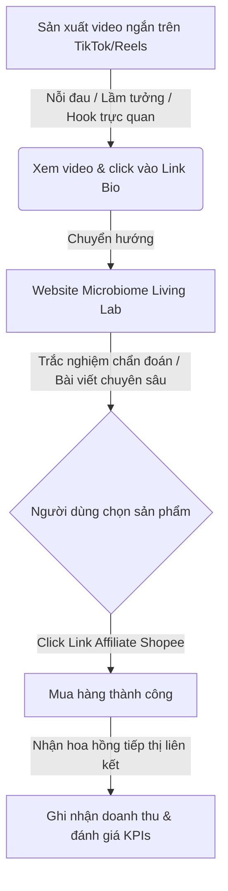

# CẨM NANG ONBOARDING 7 NGÀY - MICROBIOME LIVING LAB
*Dành cho Nhà sáng lập / Nhà sáng tạo nội dung Tiếp thị liên kết (Affiliate) trong lĩnh vực Vi sinh gia đình & Chăm sóc nhà cửa*

Chào mừng bạn đến với **Microbiome Living Lab**! Tài liệu này là lộ trình chi tiết từng ngày (được sử dụng song song với trang quản trị **Founder Hub** tích hợp sẵn trên ứng dụng) giúp bạn chính thức vận hành mô hình kinh doanh Tiếp thị liên kết cho các sản phẩm vi sinh gia đình trong vòng 7 ngày.

---

## TỔNG QUAN MÔ HÌNH KINH DOANH

### 1. Triết lý cốt lõi: "Sạch không có nghĩa là vô trùng"
Hầu hết các gia đình đang lạm dụng hóa chất tẩy rửa mạnh (nước lau sàn diệt khuẩn hóa học, nước súc miệng chứa cồn, chai xịt phòng hóa học). Điều này vô tình tiêu diệt lợi khuẩn tự nhiên, tạo ra khoảng trống sinh học cho hại khuẩn và ve bụi (mạt nhà) bùng phát.
Chúng ta định vị là một **Living Lab** (Phòng thí nghiệm sống) — cung cấp kiến thức khoa học và giải pháp cân bằng sinh học giúp cải thiện sức khỏe răng miệng, hô hấp và không gian sống cho gia đình.

### 2. Hai nhóm sản phẩm kết hợp:
*   **Vật lý / Cơ học:** Cạo lưỡi inox, máy tăm nước, máy hút bụi nệm UV-C, bình rửa mũi. (Cung cấp giải pháp tức thì, tính trực quan cao dễ làm video ngắn).
*   **Sinh học / Vi sinh:** Men vi sinh nha khoa K12/M18, xịt vi sinh kháng ve bụi nệm, xịt khử mùi enzyme sinh học, bào tử lợi khuẩn đường ruột. (Giải quyết tận gốc rễ vấn đề, tạo ra nguồn doanh thu lặp lại định kỳ).

---

## LỘ TRÌNH HÀNH ĐỘNG CHI TIẾT 7 NGÀY

### 📅 NGÀY 1: Định vị thương hiệu & Thiết lập cơ sở hạ tầng
*   **Mục tiêu:** Đăng ký tài khoản Shopee Affiliate và hiểu cấu trúc kỹ thuật của hệ thống.
*   **Các bước hành động:**
    1.  **Đăng ký Shopee Affiliate:** Truy cập chương trình tiếp thị liên kết của Shopee Việt Nam để đăng ký tài khoản đối tác. Nhận mã tracking cá nhân của bạn.
    2.  **Đọc tài liệu khoa học nền tảng:** Đọc kỹ 3 bài viết giáo dục trong Góc Kiến Thức trên website:
        *   *Lưỡi: "Mỏ vàng" của vi khuẩn gây hôi miệng* (Hiểu về màng sinh học biofilm).
        *   *Hệ sinh thái giường nệm & sức khỏe hô hấp* (Hiểu về mạt nhà/ve bụi).
        *   *Hàng rào bảo vệ tự nhiên của mũi trước bụi mịn*.
    3.  **Kiểm tra và chạy thử ứng dụng:** Chạy thử website trên localhost bằng cách gõ lệnh `npm run dev` trên cổng `3000` để kiểm tra giao diện.

---

### 📅 NGÀY 2: Lựa chọn & Đánh giá sản phẩm
*   **Mục tiêu:** Chọn ra 2-3 sản phẩm ưu tiên cao để làm nội dung thử nghiệm và đặt hàng mẫu.
*   **Các bước hành động:**
    1.  **Thực hành tính điểm sản phẩm:** Truy cập tab **Mô hình tính điểm** trên Founder Hub. Kéo các thanh trượt đánh giá từ 1-5 điểm cho 7 tiêu chí:
        *   *Cường độ nỗi đau* (Nỗi đau của khách hàng có lớn và khẩn cấp không?)
        *   *Tiềm năng nội dung* (Có dễ làm video ngắn trực quan, bắt mắt không?)
        *   *Uy tín khoa học* (Chủng vi khuẩn có được y khoa chứng minh lâm sàng không?)
        *   *Khả dụng trên sàn* (Sản phẩm có sẵn hàng chính hãng và dễ mua trên Shopee không?)
        *   *Hoa hồng tiềm năng* (Tỷ lệ hoa hồng và giá trị đơn hàng có hấp dẫn không?)
        *   *Điểm khác biệt* (Sản phẩm có điểm độc đáo gì so với hàng đại trà không?)
        *   *Khả năng mua lại* (Khách hàng có tiêu dùng hết và mua lại định kỳ không?)
    2.  **Đặt mua hàng mẫu:**
        *   *Đề xuất 1:* Cạo lưỡi inox + Hộp viên ngậm lợi khuẩn nha khoa (Ngân sách khoảng 200k - 400k VND).
        *   *Đề xuất 2:* Máy hút bụi giường nệm UV-C (Ngân sách khoảng 500k - 800k VND).
    3.  **Tạo link affiliate cá nhân:** Lấy link sản phẩm chính hãng trên Shopee, chuyển đổi qua công cụ Shopee Affiliate thành link tracking cá nhân của bạn, sau đó cập nhật vào bảng cấu hình links trên trang Founder Hub.

---

### 📅 NGÀY 3: Soạn kịch bản nội dung thử nghiệm
*   **Mục tiêu:** Viết nháp kịch bản video ngắn cho sản phẩm mẫu đã chọn theo 3 góc tiếp cận tiêu chuẩn.
*   **Các bước hành động:**
    1.  **Góc 1: Đánh trúng nỗi đau (Problem-based):**
        *   *Khái niệm:* Chia sẻ sự tự ti, bất tiện của khách hàng trong đời sống hàng ngày.
        *   *Ví dụ:* "Đánh răng ngày 3 lần mà chỉ 15 phút sau miệng đã chua lòm, thở ra có mùi làm bạn tự ti khi đứng gần đồng nghiệp?"
    2.  **Góc 2: Vạch trần lầm tưởng (Myth-busting):**
        *   *Khái niệm:* Chỉ ra một sai lầm phổ biến mà mọi người hay làm nhưng thực ra lại phản tác dụng.
        *   *Ví dụ:* "Sự thật đáng sợ: Nước súc miệng cồn cay nồng thực chất làm hơi thở hôi hơn về lâu dài vì nó diệt sạch cả lợi khuẩn..."
    3.  **Góc 3: Câu giật gân 3 giây đầu (Hook 3s):**
        *   *Khái niệm:* Cảnh báo, kích thích sự tò mò mạnh bằng hình ảnh trực quan.
        *   *Ví dụ:* "Đừng dùng nước súc miệng diệt khuẩn nếu bạn không muốn ổ vi khuẩn lưu huỳnh bùng phát!" hoặc "Cận cảnh lớp bợn trắng trên lưỡi mà bàn chải không bao giờ chải sạch được..."

---

### 📅 NGÀY 4: Quay & Dựng video ngắn đầu tiên
*   **Mục tiêu:** Sản xuất video ngắn thử nghiệm (TikTok/Reels/Shorts) có tính trực quan cao.
*   **Các bước hành động:**
    1.  **Quay các cảnh trực quan đắt giá (Shock value):**
        *   *Nếu làm về cạo lưỡi:* Quay cận cảnh (macro) cảnh cạo lưỡi từ cuống lưỡi kéo ra lớp bợn trắng nhầy (gây tò mò cực mạnh cho người xem).
        *   *Nếu làm về hút bụi nệm:* Quay cảnh giường nệm nhìn có vẻ rất sạch, sau đó hút thử 1 phút và mở khay lọc chứa đầy bụi mịn xám xịt như bột.
    2.  **Dựng video ngắn:**
        *   Thời lượng lý tưởng: 35 - 55 giây.
        *   Sử dụng phụ đề (caption) chữ to rõ ràng, nhịp dựng nhanh (không giữ một cảnh quá 3 giây).

---

### 📅 NGÀY 5: Đăng tải nội dung & Gắn link bio
*   **Mục tiêu:** Phân phối video lên các nền tảng mạng xã hội và điều hướng người xem về website.
*   **Các bước hành động:**
    1.  **Đăng tải vào khung giờ vàng:** Đăng video lên TikTok, Reels và YouTube Shorts vào khung giờ 11:30 - 13:00 (nghỉ trưa) hoặc 19:30 - 21:00 (buổi tối giải trí).
    2.  **Đặt Link Bio:** Đặt link trang Microbiome Living Lab cá nhân của bạn vào phần mô tả kênh (Bio). Kêu gọi hành động ở cuối video để điều hướng người xem: "Click vào link bio để làm trắc nghiệm chẩn đoán vi sinh miễn phí hoặc đọc cơ chế y khoa".
    3.  **Ghi nhật ký chiến dịch:** Vào **Founder Hub**, bấm nút **Thêm bài đăng mới ➕** để điền thông tin ban đầu: Ngày đăng, Nền tảng, Tiêu đề, Hook, Sản phẩm tiếp thị.

---

### 📅 NGÀY 6: Phân tích số liệu & Tối ưu chuyển đổi
*   **Mục tiêu:** Đọc hiểu các chỉ số hiệu suất trên dashboard và thực hiện tối ưu hóa.
*   **Các bước hành động:**
    1.  **Cập nhật số liệu thực tế:** Từ 24-48 tiếng sau khi đăng video, cập nhật số liệu: Lượt xem, Lượt thích, Lượt nhấn (Clicks), Đơn hàng và Doanh thu thực tế vào bảng nhật ký chiến dịch trên Founder Hub.
    2.  **Đo lường CTR & CR:**
        *   **Click-Through Rate (CTR) = Số click / Số view:** Mục tiêu tối thiểu **2.0%**. Nếu thấp hơn, nghĩa là video chưa khơi gợi đủ sự tò mò hoặc lời kêu gọi hành động (CTA) cuối video quá mờ nhạt.
        *   **Conversion Rate (CR) = Đơn hàng / Số click:** Mục tiêu từ **3.0% - 5.0%**. Nếu CTR cao nhưng CR thấp, hãy kiểm tra xem link Shopee của bạn có uy tín, nhiều lượt mua không, hoặc bài viết trên blog của bạn chưa đủ sức thuyết phục về khoa học.
    3.  **Tự đánh giá báo cáo tuần:** Nhập các số liệu tổng hợp vào tab **Báo cáo đánh giá tuần** trên Founder Hub và xuất file markdown báo cáo tuần để lưu trữ.

---

### 📅 NGÀY 7: Đóng gói Combo sản phẩm & Nhân bản kênh
*   **Mục tiêu:** Gia tăng giá trị đơn hàng bằng cách giới thiệu combo giải pháp và tối ưu hóa hệ thống tiếp thị.
*   **Các bước hành động:**
    1.  **Quảng bá combo giải pháp:** Soạn kịch bản video hướng dẫn quy trình 3 bước (ví dụ: *Quy trình diệt ve bụi đệm dứt điểm ngứa mũi*, kết hợp Máy hút nệm UV-C + Chai xịt vi sinh giường nệm).
    2.  **Đăng tải chéo đa kênh:** Đăng tải cùng một nội dung video lên cả 3 nền tảng: TikTok, Facebook Reels, và YouTube Shorts để tối đa hóa lượng truy cập tự nhiên mà không mất tiền chạy quảng cáo.
    3.  **Xuất báo cáo CSV:** Bấm nút **Xuất dữ liệu CSV 💾** từ Founder Hub để tải về toàn bộ lịch sử chiến dịch tiếp thị nhằm tối ưu cho tuần tiếp theo.

---

## KHUNG ĐÁNH GIÁ CHẤT LƯỢNG KÊNH (KPI TEMPLATE)

| Chỉ số | Yếu | Đạt yêu cầu | Xuất sắc | Hành động khắc phục |
| :--- | :--- | :--- | :--- | :--- |
| **Lượt xem (Views)** | < 1,000 | 3,000 - 10,000 | > 50,000 | Cải thiện 3 giây Hook đầu tiên, cắt nhịp dựng video nhanh hơn |
| **Tỷ lệ nhấp (CTR)** | < 1.0% | 2.0% - 5.0% | > 8.0% | Nói rõ giải pháp hơn và đưa lời kêu gọi hành động (CTA) mạnh mẽ ở cuối |
| **Tỷ lệ chuyển đổi (CR)** | < 1.0% | 3.0% - 6.0% | > 10.0% | Đọc kỹ phân tích y khoa, chuyển sang link Shopee Mall chính hãng có nhiều lượt bán |
| **Tỷ lệ mua lại (RPR)** | < 2% | 5% - 15% | > 20% | Đẩy mạnh các sản phẩm vi sinh tiêu hao nhanh (Lợi khuẩn nha khoa, xịt khử mùi enzyme) |

Chúc bạn có một tuần onboarding thành công rực rỡ và gặt hái những đơn hàng đầu tiên! Hệ thống của bạn đã sẵn sàng hỗ trợ.
